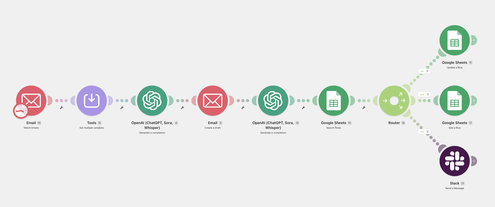

# AI Hiring Email Automation

An AI-powered recruitment workflow built in Make.com that automatically processes incoming candidate emails, generates personalized responses using GPT, updates Google Sheets, and sends Slack notifications.

---

## Overview

This project demonstrates how AI can automate repetitive recruitment communication while keeping a human-in-the-loop approach.

The workflow is built entirely in Make.com and integrates multiple services to streamline candidate communication.

---

## Features

-  Watches incoming Gmail messages
-  Uses OpenAI GPT for email understanding
-  Generates personalized draft replies
-  Stores candidate information in Google Sheets
-  Routes candidates based on workflow logic
-  Sends Slack notifications
-  Fully automated process

---

## Tech Stack

- Make.com
- OpenAI GPT
- Gmail
- Google Sheets
- Slack

---

## Workflow

---

## Process

1. New hiring email arrives.
2. Candidate information is extracted.
3. GPT analyzes the message.
4. A personalized email draft is generated.
5. Candidate data is updated in Google Sheets.
6. Workflow decides what should happen next.
7. Slack notification is sent to the hiring team.

---

## Why I Built This

I wanted to explore how Large Language Models can reduce repetitive administrative work in recruitment.

This project demonstrates practical AI automation rather than simple prompt generation by combining LLM reasoning with business workflow automation.

---

## Future Improvements

- Resume parsing
- Candidate scoring
- ATS integration
- Calendar scheduling
- Automatic follow-up emails
- Multi-language support

